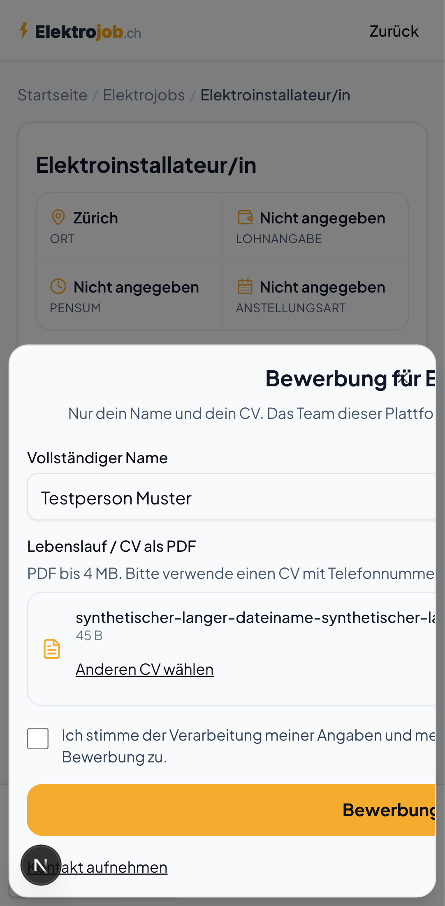
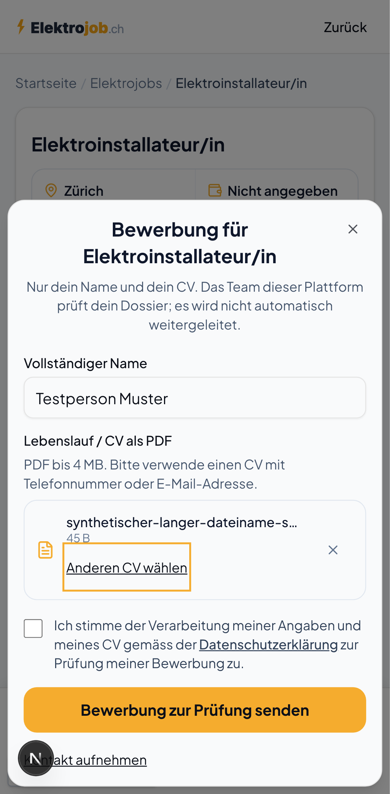
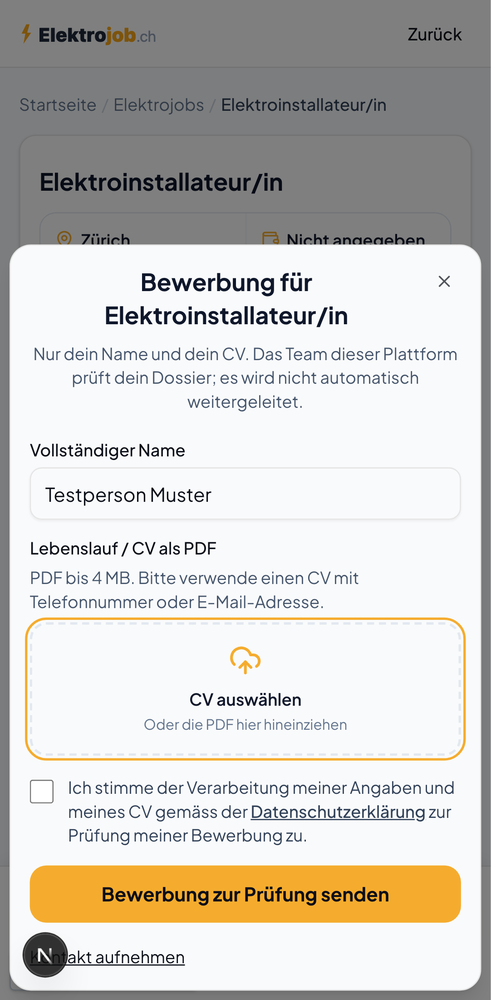

# Bewerbungsdialog: PDF-Auswahl mit Tastatur und langen Dateinamen

Geprüft am 5. Oktober 2026 auf Basis von `d5dae152851cc049a920ebd42076ceb07f7a4585`.

## Nachgewiesene Probleme

- Nach der PDF-Auswahl und nach «PDF entfernen» verschwand das fokussierte Bedienelement. Der Fokus landete auf dem Dialog; die nächste Tab-Taste führte zurück zum Namensfeld.
- Ein gültiger langer PDF-Dateiname verbreiterte das Formular über den Dialog hinaus. Auf schmalen Bildschirmen wurden Text und Bedienelemente abgeschnitten.

Beide Probleme wurden in der unveränderten Komponente von `main` nachgestellt: je ein fehlgeschlagener Fokus- und Überlaufcheck in Desktop-Chrome und Pixel-7-Emulation (vier erwartete Fehler).

## Änderung

Der Auswahlknopf bleibt beim Wechsel zwischen leerer und gefüllter Dateiauswahl erhalten. Nach dem Entfernen führt der Fokus zu diesem Knopf zurück. Ein Statusbereich nennt die ausgewählte Datei; diese Information und der PDF-Hinweis gehören auch zur zugänglichen Beschreibung des Knopfs. Eine sichtbare Fokusmarkierung hilft bei der Tastaturbedienung. Das Formular kann auf die Dialogbreite schrumpfen, sodass lange Dateinamen wie vorgesehen gekürzt angezeigt werden.

Die Änderung betrifft ausschliesslich die Darstellung und Bedienung in `apply-modal.tsx`. Dateiprüfung, Einwilligungstext, Absenden, Speicherung und Weiterleitung bleiben unverändert.

## Prüfung

`npm run check:applicant:browser` startet die vollständige lokale Next-Oberfläche und einen erfundenen Stellenkatalog. Zehn Prüfungen bestehen, jeweils fünf auf Desktop und Mobile:

1. PDF mit Enter auswählen, Fokus bei «Anderen CV wählen», Tab zu «PDF entfernen», Enter zum Entfernen, danach Tab zur Einwilligung.
2. PDF ersetzen und Dateiauswahl ohne neue Datei schliessen; bisherige Auswahl und Fokus bleiben erhalten.
3. Ungültige erste Datei und ungültiger Ersatz: Fehlermeldung, erhaltener bisheriger CV und erfolgreiche Korrektur.
4. Während einer verzögerten Dateiprüfung weitertabben; der Abschluss zieht den Fokus nicht zurück.
5. Gültiger langer Dateiname ohne horizontalen Überlauf; Escape gibt den Fokus an «Bewerbung starten» zurück; Name und Datei bleiben beim erneuten Öffnen erhalten.

Zusätzlich: alle 68 bestehenden Unit-/Render-Tests, TypeScript-Prüfung, ESLint für die geänderten Dateien und `git diff --check` bestanden.

Es werden ausschliesslich erfundene Dateien und Stellen verwendet. Die Browserprüfung blockiert externe Anfragen und sämtliche Schreibanfragen. Sie überwacht zusätzlich Formularereignisse und Browserfehler: keine Absendung, keine Schreibanfrage, kein Browserfehler. Auch synthetische Bewerbungen werden nicht abgeschickt.

Für einen vorhandenen Produktionsbuild kann die Suite mit `APPLICANT_UX_PRODUCTION=1 npm run check:applicant:browser` ausgeführt werden. Die dokumentierte lokale Prüfung verwendet den Entwicklungsserver. Native Dateiauswahldialoge, Safari, VoiceOver und echte Mobilgeräte wurden nicht geprüft. Die Statussemantik wird im Browser geprüft; gesprochene Bildschirmleser-Ausgaben wurden nicht abgehört.

## Mobile Ansichten

Vorher: der lange Dateiname vergrössert den gesamten Formularinhalt.

Nachher: Text und Bedienelemente bleiben im Dialog; die Tastaturposition ist sichtbar.

Nach «PDF entfernen» bleibt der Auswahlknopf fokussiert.

