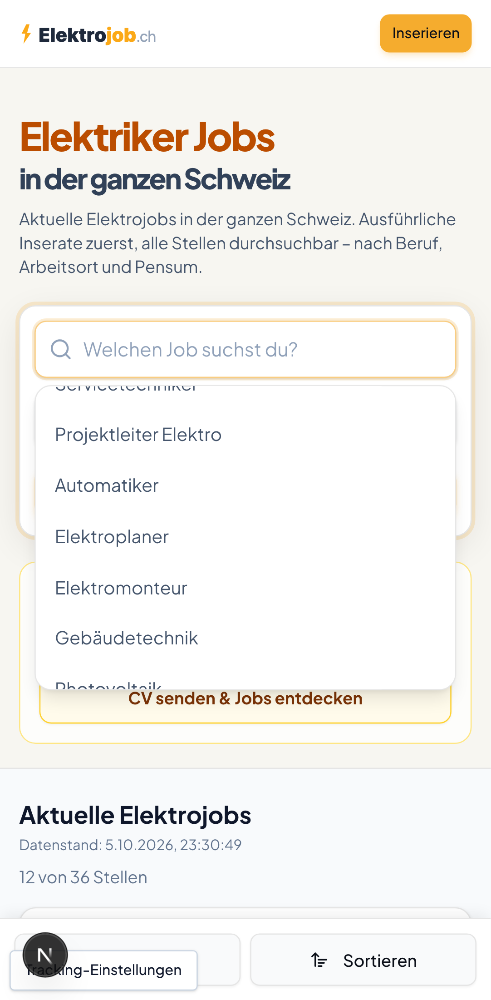
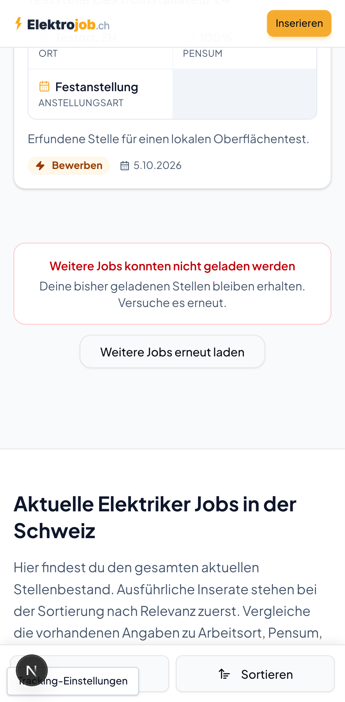

# Stellensuche: Touch-Bedienung und Wiederholen nach Ladefehlern

Die Berufsvorschläge lassen sich am Handy durchscrollen, ohne beim ersten
Berühren einen Beruf auszuwählen. Ein Klick oder Tippen wählt den Vorschlag;
der Fokus bleibt im Suchfeld, damit Enter und Tab die Suche fortsetzen können.

Wenn eine weitere Ergebnisseite nicht geladen werden kann, bleibt der Hinweis
beim Ende der Liste. «Weitere Jobs erneut laden» wiederholt diese Seite und
behält die bereits geladenen Stellen. Ein Fehler bei einer neuen Suche wird
weiterhin oben mit «Erneut laden» angezeigt.

## Reproduzierbare Prüfung

```sh
npm ci
npx playwright install chromium
npm run check:search:browser
npx tsc --noEmit
npx eslint src/components/search-dropdown.tsx src/app/_components/homepage-search.tsx e2e/search/search-ux.spec.ts playwright.search.config.ts e2e/search/empty-catalog.mjs
node --import tsx --test src/lib/*.test.ts src/components/job-detail-client-tools.test.tsx
```

Die Browserprüfung startet ausschliesslich lokale Server auf `127.0.0.1:3110`
und `127.0.0.1:3111`. Keine bestehenden Server werden wiederverwendet. Der
Server liest einen leeren lokalen Katalog; die Browser erhalten 36 erfundene
Stellen. Externe Browseranfragen und Schreibanfragen werden gesperrt. Die
bestehende Tracking-Auswahl wird mit «Nur notwendige Funktionen» geschlossen.
Es werden keine Bewerbungen abgesendet.

Voraussetzung: freier Port 3110/3111 und ein eigener Checkout ohne lokale
Produktions-Konfiguration. `SEARCH_UX_PRODUCTION=1 npm run check:search:browser`
prüft alternativ einen vorher mit denselben lokalen Datenquellen erstellten
Produktionsbuild.

## Abgedeckte Abläufe

- Beruf mit Pfeiltaste/Enter wählen, Fokus behalten, mit Tab zum Ort wechseln
  und Suche mit Enter absenden.
- Vorschlag anklicken; Escape und Tab schliessen die Vorschläge.
- Echte Touch-Ereignisse im mobilen Chromium: Liste scrollt, Eingabe bleibt
  unverändert, anschliessendes Tippen wählt gezielt einen Beruf.
- 24 Stellen laden, Fehler der dritten Seite anzeigen, genau Offset 24
  wiederholen und insgesamt 36 Stellen behalten. Am Handy stoppt der
  automatische Nachladeversuch während des Fehlers.
- Fehlgeschlagene erste Suche erneut laden.
- Nach einem Nachladefehler eine neue Suche starten: Fehler verschwindet und
  die Suche beginnt bei Offset 0.

Desktop-Chromium und Pixel-7-Emulation: 11 bestandene Prüfungen. Der reine
Touch-Test läuft nur mobil und wird am Desktop ausdrücklich übersprungen.
Die vorhandenen 68 isolierten Tests bestehen ebenfalls. Vor der Korrektur
wurden Fokusverlust nach Enter und eine ungewollte Auswahl bei `touchStart`
auf dem unveränderten Stand `d5dae152851cc049a920ebd42076ceb07f7a4585`
reproduziert.

Die Screenshots zeigen die lokale Oberfläche mit erfundenen Daten. Die
Bewegung und Anfragefolge werden durch die Browserprüfungen belegt, nicht
durch das Standbild allein. Physische Geräte, VoiceOver und Live-Daten wurden
nicht geprüft. Es gab keine Veröffentlichung auf der Live-Website.




